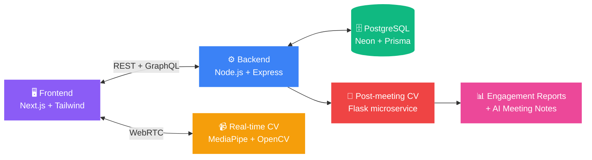

<div align="center">


<br/>

<a href="https://smartmeet-platform.vercel.app/"></a>
<a href="https://drive.google.com/file/d/1vJCgurEKFQtbW6a0b-jdf42E78mo7WCF/view"></a>
<a href="https://pucit-smartmeet.atlassian.net/jira"></a>

<br/><br/>


<br/><br/>


</div>


## 🧠 What is SmartMeet?

Zoom, Meet, and Teams can tell you **who joined**. None of them can tell you **who was actually paying attention**.

**SmartMeet** layers real-time **Deep-learning and computer-vision engagement analysis** on top of standard video conferencing — face presence, gaze direction, and head pose are tracked live, and every session ends with an automated report scoring each participant's attentiveness.

Built as a Final Year Design Project at the **Department of Software Engineering, University of the Punjab (PUCIT)**.

> 📊 Current systems measure *presence*. SmartMeet measures *attention*.


## ✨ Features

<table>
<tr>
<td width="50%" valign="top">

### 🗂️ Core Platform
- 🔐 Secure authentication (JWT-based sessions)
- 🏢 Organizations — hosts create orgs & add participants
- 📅 Meeting scheduling + link/ID-based joining
- 🎦 Real-time video, audio & chat (WebRTC)
- 🖥️ Screen sharing, mic/audio controls
- 📋 Automated attendance logging
- 📈 Host dashboard with analytics

</td>
<td width="50%" valign="top">

### 👁️ Engagement Intelligence
- **Real-time detection** (MediaPipe + OpenCV)
  - Face presence · gaze direction · head pose
- **Post-meeting deep analysis** (Flask service)
  - Posture + gaze detection
  - 16 frames sampled per 10-sec window
  - used Deep-learning For Deep facial expressions Analysis 
  - `Highly Engaged` · `Engaged` · `Not Engaged`
- 📄 Per-participant & session engagement reports
- 📝 AI meeting notes from audio/transcript

</td>
</tr>
</table>

### Related Research Project

This project is based on the deep-learning research work developed in **DG-SVFAP**.

🔗 [DG-SVFAP – Deep Learning Video Engagement Analysis](https://github.com/Salal04/DG-SVFAP)


## 🏗️ Architecture



## 🛠️ Tech Stack

| Layer | Technology |
|---|---|
| **Frontend** | Next.js, Tailwind CSS |
| **Backend** | Node.js, Express.js — REST (writes) + GraphQL (reads) |
| **Database** | PostgreSQL (Neon), Prisma ORM |
| **Real-time Communication** | WebRTC |
| **Authentication** | JWT / NextAuth / Supabase Auth |
| **Computer Vision (real-time)** | Python, OpenCV, MediaPipe |
| **Deep learning (post-processing)** | Flask, DG-SPVAF, MediaPipe |
| **Deployment** | Vercel |
| **Version Control / PM** | GitHub, Jira |


## 🚀 Getting Started

### Prerequisites
`Node.js v18+` · `npm` · `PostgreSQL` · `Python 3.9+`

<details open>
<summary><b>1️⃣ Clone the repository</b></summary>

```bash
git clone https://github.com/laiba-ajmal-12/SmartMeetFYP.git
cd SmartMeetFYP
```
</details>

<details open>
<summary><b>2️⃣ Backend setup</b></summary>

```bash
cd backend
npm install
npx prisma generate
npx prisma migrate dev
npm run dev
```
</details>

<details open>
<summary><b>3️⃣ Frontend setup</b></summary>

```bash
cd frontend
npm install
npm run dev
```
</details>

<details open>
<summary><b>4️⃣ Environment variables</b></summary>

Create a `.env` file in the backend directory:
```env
DATABASE_URL=your_database_url
JWT_SECRET=your_secret_key
PORT=5000
```
</details>

<details open>
<summary><b>5️⃣ Deep Learning service (Flask)</b></summary>

This engine lives in its own service and is kept isolated from the Node/Next stack to avoid dependency conflicts.

```bash
cd ai-service

# Recommended: use a dedicated virtual environment
python -m venv venv
source venv/bin/activate      # On Windows: venv\Scripts\activate

# Install dependencies
pip install -r requirements.txt

# Run the service
python app.py
```

**What it does:**
- Ingests short video clips (10-second windows → 16 sampled frames)
- Runs posture + gaze detection via MediaPipe
- Classifies engagement per window: `Highly Engaged` · `Engaged` · `Not Engaged`
- Aggregates results into per-participant and per-session engagement reports
- Generates meeting/class notes from audio or transcript on host request

> 💡 A consolidated copy of every other module lives alongside `app.py` for convenience during local development.
</details>

<details open>
<summary><b>6️⃣ Access the app</b></summary>

```
http://localhost:3000
```

Or use the live deployment 👉 **[smartmeet-platform.vercel.app](https://smartmeet-platform.vercel.app/)**

**Demo credentials:**
| Email | Password |
|---|---|
| `admin@smartmeet.com` | `Admin@1234` |
</details>


## 🐍 Contribution Snake

<div align="center">


*Auto-generated from commit activity — enable via the [`platane/snk`](https://github.com/Platane/snk) GitHub Action to make this live for this repo.*

</div>

## 👥 Team

<div align="center">

Developed by **Team SmartMeet**, Department of Software Engineering, FCIT — University of the Punjab, Lahore
*(BS Software Engineering, 2022–2026)*

| Name | Roll Number |
|---|---|
| Salal Shabbir | BSEF22M047 |
| AbdulAhad Tayyab | BSEF22M020 |
| Laiba Ajmal | BSEF22M030 |
| Areeha Zulfiqar | BSEF22M042 |


**Supervisor:** Dr. Muhammad Farooq, Assistant Professor

</div>

## 🔗 Links

- 🌐 Live App: [smartmeet-platform.vercel.app](https://smartmeet-platform.vercel.app/)
- 🎬 Demo Video: [Watch here](https://drive.google.com/file/d/1vJCgurEKFQtbW6a0b-jdf42E78mo7WCF/view)
- 📋 Jira Board: [pucit-smartmeet.atlassian.net](https://pucit-smartmeet.atlassian.net/jira)
- 💻 Source: [github.com/laiba-ajmal-12/SmartMeetFYP](https://github.com/laiba-ajmal-12/SmartMeetFYP)

## 📄 License

This project was developed for academic purposes as part of a Final Year Design Project. See [LICENSE](LICENSE) for details.

<div align="center">


**Meet smarter, not just longer.** ⚡

</div>
